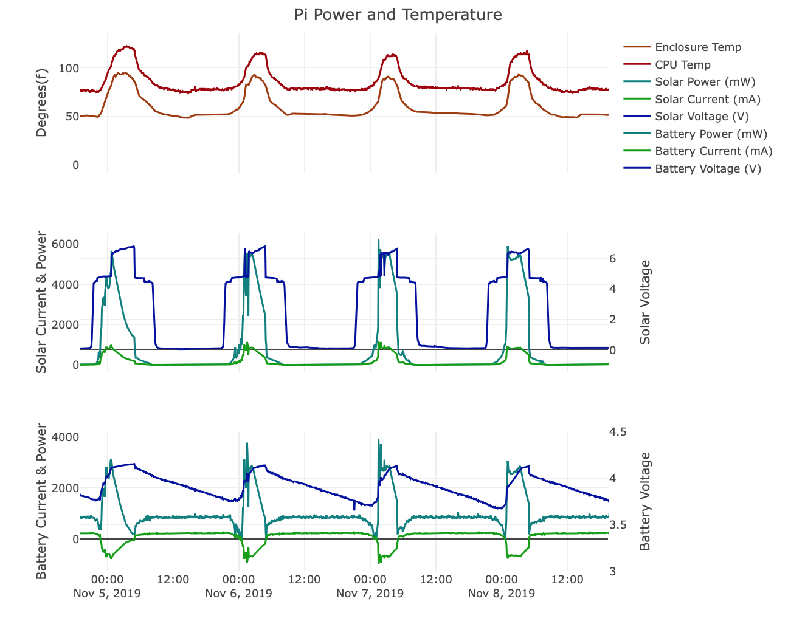

Title: A Solar Powered Raspberry Pi, Part 2
Date: 2019-11-25
Summary: The Solar Powered Pi has sensors now!

I mentioned in the last post that while the Pi was working, it was opaque - I couldn't actually see how the power was flowing over time. I went back and added a set of sensors for monitoring the voltage and current from the panel and the battery, and added in a temperature sensor as well. This post will cover the hardware and software I'm using to read that data. I'll have a follow-up post about the data itself, and a few things I've learned so far.

I actually completed this project earlier this month, but I wanted to look at the data before doing the write-up. It turns out the data's messier than I was hoping, and I've also run into some issues with the whole setup that I'll get into below.

First, the setup!

Hardware
--------
The first issue to solve for the project was how to read the voltage & current levels. The Pi itself doesn't have any analog inputs built in - it has a nice fat set of GPIO pins, but no analog. I dug into all the various ways to hack around that, but ended up settling on a pair of [I2C power sensors from Adafruit](https://www.adafruit.com/product/4226). After spending a few days researching A2D hats and voltage divider circuits for the Pi, this honestly felt like cheating - the sensors do everything I want, connect straight to the Pi, and Adafruit even provides python libraries for reading the data. I picked up a [temperature sensor](https://www.adafruit.com/product/1782) from them as well.

The rest of the setup's simple - I picked up an extension cable for the battery and the solar panel to splice into the power sensors, and got some hammerless headers for the pi (I can solder just fine, I'm just not enough of a masochist to solder a 40-pin header by hand). I grabbed some jumper cables and created a little wiring harness - one of the benefits of I2C is I only needed to use 4 pins from the Pi.

Here's a picture of the completed setup:


Software
--------
Adafruit's got a really solid set of libraries for working with the sensors - when you've got everything set up, the code to read the sensors is just:
```
ina260 = adafruit_ina260.INA260(i2c, address)
print(ina260.voltage, ina260.current, ina260.power)‌
```
I put together a script to read from all three sensors (and the CPU temperature) and output to a CSV, and then set up a cron job to run it every 5 minutes.

Finally, to actually view the data, I put together a page on the blog using Plot.ly (I spent a day screwing around with D3 before coming to my senses and using someone else's library). I'm not going to link to that page directly yet, but here's what it looks like:

(The temperature is in Fahrenheit because I made a mistake)

Aftermath
---------
So this whole setup worked great for about a week, but I ran into problems shortly after - effectively, the battery won't charge when the Pi is also plugged in. I've dug into a couple possibilities with it - I swapped batteries, opened the box in case it was thermal, and kept the battery in without the Pi, just to see what was happening. As far as I can tell, the issues is that the panel's not generating enough juice anymore to power both the battery and the Pi at the same time, and the solar charger circuit is cutting it off. You can see from the image above how sharp the drop-off is in power output for the panel between "enough sun" and "not enough sun", and even a small shadow on the panel cuts power output dramatically.

I'm going to dig into this more in a future post - I need to find a good way of actually loading the panel so I can see some real numbers on how it performs under different lighting situations. Right now, all the numbers I've got are mediated by the solar charging circuit, which turns out to be a bigger part of the equation than I'd understood. The takeaway so far, though, is that solar panels are much more sharply affected by the lighting conditions than I'd thought.

I also need to swap the enclosure for something larger and get a proper mount panel for the circuit boards - adding the sensors and the wiring moved the current case from "adequate" to "crowded," and I'm concerned about the temperatures inside without a bit more room to breath.

I'll dig into the data from the sensors more in the next post.

Parts list
---------
As before, all the parts were from Adafruit. Grand total this time was a fairly modest $38.75 - here's a link to the part list:
[Solar Powered Raspberry Pi Sensors & Parts](http://www.adafruit.com/wishlists/497175)
